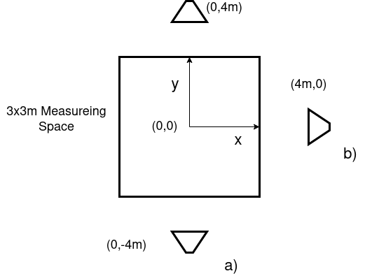

# Procedure of experiment to measure accuracy

In the following the procedure is described

## Procedure Measurement for Tripod experiments

1. Mount the Lighthouses at elevated positions at the edges of the workspace. For all experiments this position was noted down and publish along with the raw data
2. Place the Tripod on which the Vive is mounted together with the connector plate on the workspace corner which will be signified as workspace origin. Using the tripod, a level position with the ground is attempted to be achieved
3. Starting with the origin position on the connector plate and then along the x and y axis respectively measure the position of the laser targets
4. Perform a test measurement at the y axis point to verify that the new coordinate system has been set correctly. Do the same for the origin position
5. The Tripod setup is moved within the workspace at each point Vive tracker position data is recorded as well as the 4 target position. These target position are the origin, on the x and on the y-axis as well as again at the origin to verfiy correctness

## Procedure Measurent Lighthouse Accuracy

### Initial Setup

This experiment will compare the accuracy of the lighthouse system depending on the relative position of the lighthouses towards each other a) 180° b) 90°. This can be seen in the sketch below.

The general setup is as follows.

* Marking out a 3x3m area.
* Placing the lighthouses as marked out in the sheet 4m from the center
* The Lighthouses are put to maximum height of the tracker and put at  a 30° angle to the horizont
* The lasertracked is positioned somewhere more than 1.5m from the marked out area
* The Vive tracker is placed on the ground mounted on the adapter (see picture which is to be added)
* Now the distances to the lighthouses are taken using the Vive system (this is done to later accuractly plot the positions)
* The laser tracker measures the target at the 3 postiions marekd out on the tracker. Origin of connector-X Axis-Y Axis

### Actual Procedure

1. Moutn adapter onto to tripod. 
2. Move the tripod 

## Procedure Measurement for Robot Experiments

1. Mount the Lighthouses at elevated positions at the edges of the workspace. For all experiments this position was noted down and publish along with the raw data
2. Mount the connector plate on the end effector and place Vive tracker and target holders.
3. Starting with the origin position on the connector plate and then along the x and y axis respectively measure the position of the laser targets
4. Perform a test measurement at the y axis point to verify that the new coordinate system has been set correctly. Do the same for the origin position
5. The Robot setup is moved within the workspace at each point Vive tracker position data is recorded as well as the 4 target position. These target position are the origin, on the x and on the y-axis as well as again at the origin to verfiy correctness

## Procedure Finding Center of Lighthouse

Mounting the 